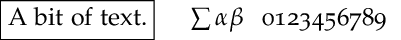

============
Introduction
============

.. contents::

.. _motivation:

Motivation
----------

The gram Python package exists to aid making vector graphics programmatically.
I made it for drawing phylogenetic trees, which are sufficiently stylized that
it makes sense to draw them with a program or script.  It might be useful for
other graphics; for example I also use it for simple plots.

Typesetting of text is best done, I think, with LaTeX. Text and graphics
together can be done well with the wonderful LaTeX graphics package `TikZ <https://en.wikipedia.org/wiki/PGF/TikZ>`_.  The
gram package uses a tiny subset of TikZ, and sets up the ability to make simple
TikZ pictures programmatically.  It takes some of the drudgery out of making the
same sort of pictures over and over again.  It is one possible solution of a
classic trade-off between time-consuming flexibility and a quick but limited
solution.

Output might include TikZ and the resulting PDF, and perhaps a PNG made from
that PDF.  The PDF is usually just the figure itself, not typeset on a page.
For paper output the PDF file would be most useful, and you can "include" it.
Output from gram can also include SVG; it is not derived from TikZ, but does
attempt to mimic it to some extent.  For web output the PNG or SVG would be
useful.  The original plan was that the TikZ output would allow you to tweak it
further, but in practice I find I hardly ever want to do that.

The SVG output allows a workflow where you use gram output in SVG, then use
Inkscape to modify it further, and then use the PDF, SVG, or PNG from Inkscape
in paper or web output.

I had various design goals for ``gram``:

- Scriptable in Python

- Human-readable text output (TikZ and SVG)

- Vector graphics output (PDF and SVG)

- Nice text (TikZ)

- LaTeX friendly (TikZ and PDF)

- Web friendly (SVG, and PNG from PDF)

I found that for some diagrams that I wanted to make I needed to know how big
the text was.  An example might be the brackets that are sometimes placed on the
right of groups of taxa in phylogenetic trees, like this ---

.. image:: ./A_gram/textHowBig.svg

It turns out that getting the size of text is not trivial.  As a hack I can measure the size of LaTeX text using PyX, and I can measure the size of SVG using Inkscape, and so both of these are required.

.. _gram-package:

The gram package
----------------

The gram package provides the Gram class, a base class which is subclassed to
make the TreeGram and Plot classes.  The purpose of gram is to make PDF diagrams
for inclusion in other documents, or to make PNG or SVG diagrams for inclusion
in web pages.

Gram makes PDF via PDFLaTeX with TikZ.  TikZ, with its underlying ``pgf`` graphics
engine, is a wonderfully capable package by Till Tantau (also the author of the
Beamer package).  The internals of gram mimics TikZ in some small ways, but only
provides a tiny fraction of the capabilities of TikZ.  Gram makes PNG files from
the PDF files, using Ghostscript.  Gram makes SVG files using mostly the same
interface.

The PDF files that Gram makes would typically be included in your document
unscaled; the font sizes and line widths in the Grams are chosen to be correct
when not scaled.  However, it is possible to make very big PDF files with
``pdf()`` and using TikZ they are not scaled either -- the scaling can be done
when including the big PDF in your document.  When making a page-sized PDF with
``pdfPage()``, if the size of the diagram is too big to fit on a sheet of A4 then
it is scaled down to fit.

.. _dependencies:

Dependencies
------------

For now it works with Python 2.7; it is not yet ported to Python3.  

p4
    The gram package requires `p4 <http://p4.nhm.ac.uk/>`_, a Python package for phylogenetics.  You can get it from `GitHub <https://github.com/pgfoster/p4-phylogenetics>`_. 

TeX
    If using PDFLaTeX and TikZ you will need a TeX installation, including PDFLaTeX and TikZ.  `TeXLive <https://www.tug.org/texlive/>`_ is recommended.

PyX
    In addition to TeX you will need `PyX <http://pyx.sourceforge.net/>`_, the Python package. Newer versions are available on PiPI, but they are for Python3.  The latest for Python 2.7 is version 0.12.1 and it does not appear to be available anymore.  I include version 0.12 with the source code of gram.

Ghostscript
    This is needed for making PNG files from PDF.  It is included in my MacTeX, the TeXLive for the Mac.

drawgram
    If making radial trees using Felsenstein's equal daylight algorithm you will need  ``drawgram`` from the `Phylip <http://evolution.genetics.washington.edu/phylip.html>`_ package.  On Ubuntu, ``apt-get`` installs it as ``/usr/lib/phylip/bin/drawgram``, which is not in the path.  In that case you will need to do some sort of workaround to get drawgram somewhere in your path.

Inkscape
    This should work at the command line, as ``inkscape``.  So if you are using Inkscape.app on the Mac, you can add ``/Applications/Inkscape.app/Contents/Resources/bin`` to your PATH.

.. _installation:

Installation
------------

Move or copy the gram directory to somewhere in your PYTHONPATH.

.. _defaults:

Defaults and configuration files
--------------------------------

There are a few defaults that you might want to set.  The way they are set
in Gram by default is

::

    font = 'Helvetica'
    documentFontSize = 10
    pdfViewer = 'ls'
    svgTextNormalWeight = 400

You can set some defaults in a ``~/.gram.conf`` file, or in a ``gram.conf`` file in your working directory.  Such a file is like this, for example

::

    [Gram]
    font = palatino
    documentFontSize = 11
    pdfViewer = open

Notice in a Python script that strings need to be quoted, but in the ``conf`` file they do not.

These variables can also be set in any gram Python script,
over-riding defaults that you or the program set.  

::

    gr = Gram()
    gr.font = 'palatino'

The ``documentFontSize`` is the size of font that is ``normalsize`` in the enclosing
document.  Font sizes are relative to that, as in LaTeX (small, normalsize, large, and so on).

The ``svgTextNormalWeight`` determines how bold the normal font weight will be in
SVG output.  I think that 300 is normal, and 400 is a little bolder.  I have it
set to 400 by default in gram, because I thought that 300 looked too light.

Here is a PNG; ``svgTextNormalWeight`` does not apply

.. image:: A_gram/Gram/fontWeight.png

Here is an SVG with ``svgTextNormalWeight = 300``

.. image:: A_gram/fontWeight300.svg

Here is an SVG with ``svgTextNormalWeight = 400``

.. image:: A_gram/fontWeight400.svg

Another default that you may want to set is the ``pdfViewer``.  When you make PDF
files you may view the result on screen, and to do that you will want to specify
your PDF viewer.  By default it is set to '``ls``', which is a safe but useless
choice on any platform. You might use ``open`` on the Mac, but on a linux machine
you might want to use ``xpdf``, or whatever your favourite is this week.  

This week, in Gram, you can set

.. table::

    +-------------------------+-----------+
    | \                       |   default |
    +=========================+===========+
    | ``font``                | Helvetica |
    +-------------------------+-----------+
    | ``documentFontSize``    |        10 |
    +-------------------------+-----------+
    | ``pdfViewer``           |    ``ls`` |
    +-------------------------+-----------+
    | ``pngResolution``       |       140 |
    +-------------------------+-----------+
    | ``svgPxForCm``          |        55 |
    +-------------------------+-----------+
    | ``svgTextNormalWeight`` |       400 |
    +-------------------------+-----------+

You can leave these unset, or you can set these, in order of precedence, in 

- ``~/.gram.conf``

- ``gram.conf``   (in your working directory)

- or in your Python script

.. _sizes:

Dimensions of PDF, PNG, and SVG made by gram
--------------------------------------------

Here I make a simple 1 cm × 1 cm square, output in a PNG and an SVG file.  The PNG is made from a PDF so we get that as well.  Here are ``size.png`` and ``size.svg``.

.. code:: python

    from gram import Gram

    gr = Gram()
    gr.font = 'helvetica'
    gr.baseName = 'size'
    gr.pngResolution = 90
    gr.svgPxForCm = 35.43307
    gr.grid(0,0,1,1,color='black')
    gr.png()
    gr.svg()

    gr.baseName = 'sizeB'
    gr.pngResolution = 200
    gr.svgPxForCm = 100
    gr.png()
    gr.svg()

.. image:: ./A_gram/Gram/size.png

.. image:: ./A_gram/size.svg

These graphics above show up on my screen at about 0.9 cm per square, so that is only a little on the small side.  Preview on my Mac tells me that the PDF is 1.11 × 1.01 cm, and consistent with that it shows a bit of whitespace on the right.  When I include the PDF and the PNG in a PDFLaTeX file, they are both the same size --- 1 cm.  When I import the SVG and the PNG file into Inkscape, they are both deemed to be 1 cm square.

Here below are ``sizeB.png`` and ``sizeB.svg``., made with different ``pngResolution`` and ``svgPxForCm``.  On my screen they are 2.1 and 2.7 cm, respectively.  In a PDFLaTeX file the higher resolution PNG file appears as 1 cm, and it is also 1 cm when imported into Inkscape.  However the SVG file appears as 2.8 cm on a side when imported into Inkscape.

.. image:: ./A_gram/Gram/sizeB.png

.. image:: ./A_gram/sizeB.svg

So while PDFLaTeX appears to be sane, if you use web output real sizes are not on, as far as I can see with my limited experimentation.  The problem is that dpi varies, and I expect varies moreso these days with hi-res screens.

Gram and Inkscape
-----------------

We can start with an SVG or PDF from gram and tweak it further in Inkscape.  This might well be a useful workflow.  Here I look into how that can be done, looking at 

- integrity of the export

- file size

- whether the text is editable in Inkscape

- whether we get `old style figures <https://en.wikipedia.org/wiki/Text_figures>`_ (OSF) in Palatino

.. code:: python

    from gram import Gram

    gr = Gram()
    gr.font = 'palatino'
    gr.baseName = 'little'
    g = gr.text("A bit of text.", 1,0)
    g.draw = True
    g = gr.text(r"$\sum \alpha\beta$", 2.5, 0)
    g.anchor = 'west'
    g = gr.text("0123456789", 3.5, 0)
    g.anchor = 'west'
    gr.png()

    gr = Gram()
    gr.font = 'palatino'
    gr.baseName = 'little'
    g = gr.text("A bit of text.", 1,0)
    g.draw = True
    g = gr.text('&#x2211;<tspan style="font-style: italic;">&#x03b1;&#x03b2;</tspan>', 2.5, 0)
    g.anchor = 'west'
    g = gr.text("0123456789", 3.5, 0)
    g.anchor = 'west'
    gr.svg()

Here is the PNG of a small gram figure, using Palatino, with some LaTeX maths nonsense and some numbers ---

and here is the SVG (file size 832 bytes) ---

Here is the SVG made by Inkscape 0.91, after importing the gram PDF file without using Poppler.  The file is 5.4 Kbytes, and the text appears to have been turned into Times --- that it should be Palatino appears to have been lost on export.

In Inkscape, the file above looked like this PNG below.  In Inkscape, the text on the left looked fine --- it was URWPalladioL, a version of Palatino.  However, the text on the right was not rendered well; it was PazoMath, which I suspect is TeX only.  All of the text was editable in Inkscape; although limited because the fonts URWPalladioL and PazoMath were not available to Inkscape.

If I took that SVG file and edited it so that all the fonts specified Palatino (rather than URWPalladioL or PazoMath), then it looked fine, and was editable.  Here it is ---

This next one is is the SVG made by Inkscape after the gram PDF was imported into Inkscape using Poppler.  That does tracing around the characters, and so the file is big (27397 bytes).  Being a tracing, it is not editable as text in Inkscape.

And here is the Inkscape SVG made from the Gram SVG ---

To conclude:

- Gram SVG plays well with Inkscape (although Unicode is a pain to make in gram)

- Gram PDF is possible with Inkscape if you do not use Poppler, and if you fix the fonts that get assigned by Inkscape

- Gram PDF imported to Inkscape using Poppler is all right, but the text is not editable as text, and the files are big

- If you want OSF with Palatino then use TikZ.  I don't know how to get OSF with Palatino in in SVG.
